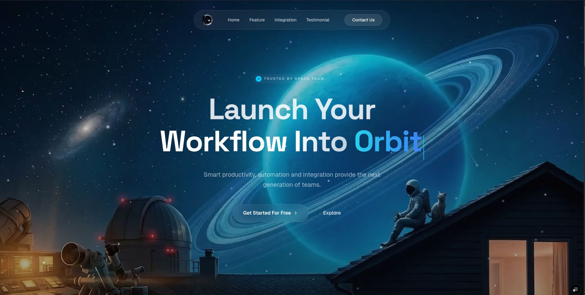

# Orbit Workflow

Orbit Workflow is a high-performance, visually stunning landing page built using modern web technologies. It features smooth animations, responsive design, and a premium user experience.

## Tech Stack

- **Framework:** [React 19](https://react.dev/)
- **Build Tool:** [Vite](https://vitejs.dev/)
- **Styling:** [Tailwind CSS 4](https://tailwindcss.com/)
- **Animations:** [GSAP](https://gsap.com/) & [Motion](https://motion.dev/)
- **Icons:** [Phosphor Icons](https://phosphoricons.com/) & [Lucide React](https://lucide.dev/)
- **Language:** [TypeScript](https://www.typescriptlang.org/)
- **Graphics:** [OGL](https://github.com/o-g-l/ogl) (WebGL)

## Preview

* Desktop

